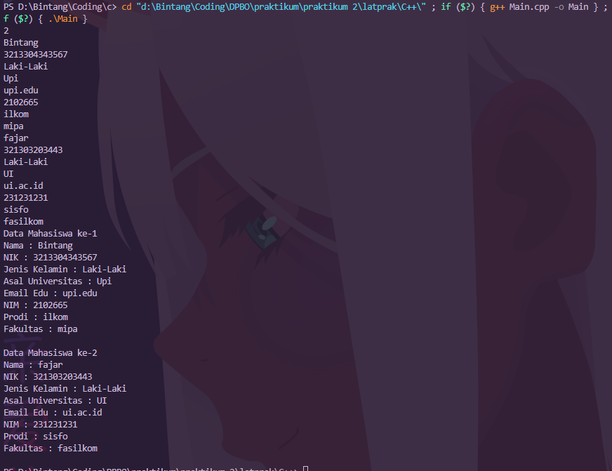

.png)

# Janji
Saya Muhammad Cahyana Bintang Fajar NIM 2102665 mengerjakan Latihan 2 dalam mata kuliah Desain dan Pemrograman Berorientasi Objek untuk keberkahanNya maka saya tidak melakukan kecurangan seperti yang telah dispesifikasikan. Aamiin.

## Desain Program 
Terdiri dari 3 class yaitu **Human**, **SivitasAkademik** dan  **Mahasiswa**, Mahasiswa itu extends dari SivitasAkademik atau SivitasAkademik adalah orang tua dari Mahasiswa, lalu SivitasAkademik extend dari Human atau Human adalah orang tua dari Sivitas Akademik

Didalam class **Human** memiliki 3 Atribut, yaitu : 
* Nama
* NIK
* Jenis Kelamin 

Didalam class **SivitasAkademik** memiliki 2 Atribut, yaitu : 
* Asal Universitas
* Email Edu

Didalam class **Mahasiswa** memiliki 3 Atribut, yaitu : 
* NIM
* Prodi
* Fakultas 

### Dokumentasi PHP

### Dokumentasi CPP

### Dokumentasi Java

### Dokumentasi Python

